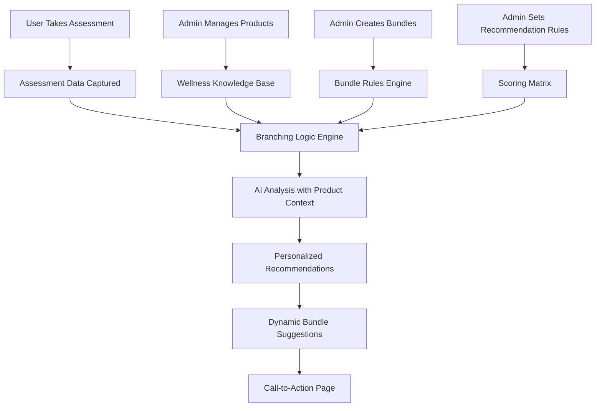

# 🧠 AI UPGRADE SYSTEM FLOW - COMPREHENSIVE WIREFRAME

## 🎯 SYSTEM OVERVIEW FLOW



## 📊 DETAILED SYSTEM ARCHITECTURE

### **PHASE 1: DATA COLLECTION & ANALYSIS**

```
┌─────────────────────────────────────────────────────────────────┐
│                    ASSESSMENT DATA CAPTURE                      │
├─────────────────────────────────────────────────────────────────┤
│                                                                 │
│  User Profile:           Assessment Responses:                  │
│  ├─ Age: 35             ├─ Hydration: 4/10                     │
│  ├─ Weight: 70kg        ├─ Sleep: 3/10                         │
│  ├─ Height: 175cm       ├─ Exercise: 8/10                      │
│  ├─ Gender: Female      ├─ Nutrition: 5/10                     │
│  └─ Priority: Health    ├─ Stress: 7/10                        │
│                         └─ Individual Q&A: 20 responses         │
│                                                                 │
│  Behavioral Data:        Contextual Data:                      │
│  ├─ Response Time        ├─ Time of Day                        │
│  ├─ Confidence Level     ├─ Device Used                        │
│  ├─ Hesitation Patterns  └─ Completion Rate                    │
│  └─ Priority Rankings                                          │
└─────────────────────────────────────────────────────────────────┘
```

### **PHASE 2: INTELLIGENT BRANCHING LOGIC**

```
┌─────────────────────────────────────────────────────────────────┐
│                   BRANCHING LOGIC ENGINE                        │
├─────────────────────────────────────────────────────────────────┤
│                                                                 │
│  CONDITION DETECTION:                                           │
│  ┌─────────────────┐    ┌─────────────────┐                   │
│  │ Sleep Issues    │    │ Hydration Def.  │                   │
│  │ Score: 3/10     │    │ Score: 4/10     │                   │
│  │ Severity: HIGH  │    │ Severity: MOD   │                   │
│  │ Priority: 1     │    │ Priority: 2     │                   │
│  └─────────────────┘    └─────────────────┘                   │
│                                                                 │
│  DEMOGRAPHIC MATCHING:                                          │
│  ┌─────────────────────────────────────────────────────────────┐ │
│  │ Profile: Active Female, 35, BMI 23                         │ │
│  │ Matches: Executive Wellness, Women's Health, Active Life   │ │
│  └─────────────────────────────────────────────────────────────┘ │
│                                                                 │
│  SCORING MATRIX:                                                │
│  ┌─────────────────────────────────────────────────────────────┐ │
│  │ Sleep Optimization Bundle: 95% match                       │ │
│  │ Hydration Support Pack: 78% match                          │ │
│  │ Complete Wellness Bundle: 87% match                        │ │
│  └─────────────────────────────────────────────────────────────┘ │
└─────────────────────────────────────────────────────────────────┘
```

### **PHASE 3: AI-ENHANCED PRODUCT MATCHING**

```
┌─────────────────────────────────────────────────────────────────┐
│                 AI ANALYSIS WITH PRODUCT CONTEXT                │
├─────────────────────────────────────────────────────────────────┤
│                                                                 │
│  INPUT TO AI:                                                   │
│  ┌─────────────────────────────────────────────────────────────┐ │
│  │ • Assessment Results + Demographics                         │ │
│  │ • Available Product Catalog (Real-time from DB)            │ │
│  │ • Wellness Knowledge Base                                   │ │
│  │ • Bundle Options & Pricing                                  │ │
│  │ • Recommendation Rules & Scoring Matrix                     │ │
│  └─────────────────────────────────────────────────────────────┘ │
│                                                                 │
│  AI PROCESSING:                                                 │
│  ┌─────────────────────────────────────────────────────────────┐ │
│  │ 1. Analyze health patterns & risk factors                  │ │
│  │ 2. Match conditions to product benefits                     │ │
│  │ 3. Consider demographic preferences                         │ │
│  │ 4. Optimize for budget & lifestyle                         │ │
│  │ 5. Generate personalized messaging                          │ │
│  │ 6. Identify upsell opportunities                           │ │
│  └─────────────────────────────────────────────────────────────┘ │
│                                                                 │
│  AI OUTPUT:                                                     │
│  ┌─────────────────────────────────────────────────────────────┐ │
│  │ • Primary Recommendations (3-5 products)                   │ │
│  │ • Bundle Suggestions (1-3 bundles)                         │ │
│  │ • Personalized Health Message                              │ │
│  │ • Urgency Level & Confidence Score                         │ │
│  │ • Upsell Opportunities & Timing                            │ │
│  └─────────────────────────────────────────────────────────────┘ │
└─────────────────────────────────────────────────────────────────┘
```

## 🎨 USER EXPERIENCE FLOW

### **CURRENT vs ENHANCED FLOW:**

```
CURRENT FLOW:
Assessment → Generic AI Analysis → Static Results → Basic CTA

ENHANCED FLOW:
Assessment → Intelligent Analysis → Dynamic Recommendations → Personalized CTA
```

### **ENHANCED RESULTS PAGE WIREFRAME:**

```
┌─────────────────────────────────────────────────────────────────┐
│                    PERSONALIZED RESULTS PAGE                    │
├─────────────────────────────────────────────────────────────────┤
│                                                                 │
│  👋 Hi Sarah! Your Health Assessment Results                    │
│                                                                 │
│  🎯 YOUR PRIORITY AREAS:                                        │
│  ┌─────────────────┐ ┌─────────────────┐ ┌─────────────────┐   │
│  │ 😴 SLEEP        │ │ 💧 HYDRATION    │ │ 🏃 FITNESS      │   │
│  │ Score: 3/10     │ │ Score: 4/10     │ │ Score: 8/10     │   │
│  │ ⚠️  URGENT      │ │ ⚠️  MODERATE    │ │ ✅ EXCELLENT    │   │
│  └─────────────────┘ └─────────────────┘ └─────────────────┘   │
│                                                                 │
│  🤖 AI PERSONALIZED MESSAGE:                                   │
│  ┌─────────────────────────────────────────────────────────────┐ │
│  │ "Sarah, your assessment shows you're highly active but      │ │
│  │ struggling with sleep quality. This is common in high-      │ │
│  │ performers and can significantly impact your energy and     │ │
│  │ recovery. The good news? Small changes can yield big        │ │
│  │ results for someone with your fitness foundation."          │ │
│  └─────────────────────────────────────────────────────────────┘ │
│                                                                 │
│  🎯 RECOMMENDED FOR YOU:                                        │
│  ┌─────────────────────────────────────────────────────────────┐ │
│  │ 🌟 SLEEP OPTIMIZATION BUNDLE                               │ │
│  │ ├─ Magnesium Complex (for muscle recovery & sleep)         │ │
│  │ ├─ Sleep Tracking App (optimize your sleep cycles)         │ │
│  │ ├─ Blue Light Glasses (reduce evening screen impact)       │ │
│  │ └─ Guided Sleep Meditations                                │ │
│  │                                                             │ │
│  │ 💰 Bundle Price: $89.99 (Save $25 vs individual)          │ │
│  │ 🎯 Expected Results: Better sleep within 2-3 weeks         │ │
│  │ ⭐ Confidence: 95% match for your profile                  │ │
│  └─────────────────────────────────────────────────────────────┘ │
│                                                                 │
│  💧 HYDRATION SUPPORT PACK                                     │
│  ┌─────────────────────────────────────────────────────────────┐ │
│  │ Perfect for active individuals like you                     │ │
│  │ ├─ Electrolyte Powder (post-workout recovery)              │ │
│  │ ├─ Smart Water Bottle (track daily intake)                 │ │
│  │ └─ Hydration Reminder App                                   │ │
│  │ Price: $45.99 | Expected Results: 1-2 weeks                │ │
│  └─────────────────────────────────────────────────────────────┘ │
│                                                                 │
│  🚀 UPGRADE OPPORTUNITY:                                        │
│  ┌─────────────────────────────────────────────────────────────┐ │
│  │ 💎 COMPLETE WELLNESS TRANSFORMATION                        │ │
│  │ Get both bundles + personalized coaching for just $149.99  │ │
│  │ (Save $45 + get 3 months of expert guidance)               │ │
│  │ 🎯 Perfect for ambitious professionals like you            │ │
│  └─────────────────────────────────────────────────────────────┘ │
│                                                                 │
│  [🛒 GET SLEEP BUNDLE] [💧 ADD HYDRATION] [💎 COMPLETE PACKAGE] │
│                                                                 │
│  📅 Follow-up: We'll check your progress in 3 weeks           │
└─────────────────────────────────────────────────────────────────┘
```

## 🔧 ADMIN MANAGEMENT FLOW

### **ADMIN DASHBOARD ENHANCEMENTS:**

```
┌─────────────────────────────────────────────────────────────────┐
│                      ADMIN AI MANAGEMENT                        │
├─────────────────────────────────────────────────────────────────┤
│                                                                 │
│  📊 RECOMMENDATION PERFORMANCE:                                 │
│  ┌─────────────────────────────────────────────────────────────┐ │
│  │ Sleep Bundle: 87% conversion rate ↑ 23%                    │ │
│  │ Hydration Pack: 65% conversion rate ↑ 15%                  │ │
│  │ Complete Package: 34% conversion rate ↑ 45%                │ │
│  └─────────────────────────────────────────────────────────────┘ │
│                                                                 │
│  🧠 WELLNESS KNOWLEDGE BASE:                                    │
│  ┌─────────────────────────────────────────────────────────────┐ │
│  │ [+ Add Condition] [Edit Rules] [View Analytics]            │ │
│  │                                                             │ │
│  │ Sleep Disorders:                                            │ │
│  │ ├─ Insomnia (Score 0-4) → Magnesium + Melatonin           │ │
│  │ ├─ Poor Sleep Quality (Score 3-6) → Sleep Tracker         │ │
│  │ └─ Sleep Apnea Risk (BMI >30) → Medical Referral          │ │
│  └─────────────────────────────────────────────────────────────┘ │
│                                                                 │
│  📦 BUNDLE MANAGEMENT:                                          │
│  ┌─────────────────────────────────────────────────────────────┐ │
│  │ [Create Bundle] [Edit Existing] [Performance Analytics]    │ │
│  │                                                             │ │
│  │ Active Bundles:                                             │ │
│  │ ├─ Sleep Optimization ($89.99) - 45 sales this month      │ │
│  │ ├─ Hydration Support ($45.99) - 32 sales this month       │ │
│  │ └─ Complete Wellness ($149.99) - 18 sales this month      │ │
│  └─────────────────────────────────────────────────────────────┘ │
│                                                                 │
│  ⚙️ RECOMMENDATION RULES:                                       │
│  ┌─────────────────────────────────────────────────────────────┐ │
│  │ [Add Rule] [Test Logic] [A/B Test Setup]                   │ │
│  │                                                             │ │
│  │ IF: Sleep Score < 5 AND Exercise Score > 7                 │ │
│  │ THEN: Recommend Sleep Bundle (Priority: High)              │ │
│  │ MESSAGE: "Your active lifestyle needs quality recovery"    │ │
│  └─────────────────────────────────────────────────────────────┘ │
└─────────────────────────────────────────────────────────────────┘
```

## 🔄 DATA FLOW ARCHITECTURE

### **SYSTEM INTEGRATION FLOW:**

```
┌─────────────────────────────────────────────────────────────────┐
│                        DATA FLOW DIAGRAM                        │
├─────────────────────────────────────────────────────────────────┤
│                                                                 │
│  1. ASSESSMENT COMPLETION                                       │
│     ↓                                                           │
│  2. DATA CAPTURE (assessment_responses, assessment_results)     │
│     ↓                                                           │
│  3. BRANCHING LOGIC ENGINE                                      │
│     ├─ Query wellness_knowledge_base                           │
│     ├─ Apply recommendation_rules                              │
│     └─ Calculate product_bundles matches                       │
│     ↓                                                           │
│  4. AI ANALYSIS (Enhanced with product context)                │
│     ├─ Generate personalized prompt                            │
│     ├─ Call OpenAI API                                         │
│     └─ Parse structured recommendations                        │
│     ↓                                                           │
│  5. STORE RESULTS (ai_recommendation_results)                  │
│     ↓                                                           │
│  6. RENDER PERSONALIZED UI                                     │
│     ├─ Dynamic product recommendations                         │
│     ├─ Personalized messaging                                  │
│     └─ Intelligent upsell opportunities                       │
│                                                                 │
│  FEEDBACK LOOP:                                                 │
│  Purchase Data → Update Recommendation Rules → Improve AI      │
└─────────────────────────────────────────────────────────────────┘
```

## 🎯 SUCCESS METRICS & VALIDATION

### **KEY PERFORMANCE INDICATORS:**

```
┌─────────────────────────────────────────────────────────────────┐
│                         SUCCESS METRICS                         │
├─────────────────────────────────────────────────────────────────┤
│                                                                 │
│  📈 CONVERSION METRICS:                                         │
│  ├─ Assessment to Purchase: Target 25% → 40%                   │
│  ├─ Bundle vs Individual: Target 60% bundle selection          │
│  ├─ Average Order Value: Target $75 → $120                     │
│  └─ Upsell Success Rate: Target 30%                            │
│                                                                 │
│  🎯 RECOMMENDATION ACCURACY:                                    │
│  ├─ AI Confidence Score: Target >85%                           │
│  ├─ User Satisfaction: Target >4.5/5                           │
│  ├─ Recommendation Relevance: Target >90%                      │
│  └─ Follow-up Purchase Rate: Target >20%                       │
│                                                                 │
│  ⚡ SYSTEM PERFORMANCE:                                         │
│  ├─ Response Time: <2 seconds                                  │
│  ├─ AI Processing: <5 seconds                                  │
│  ├─ Cache Hit Rate: >80%                                       │
│  └─ System Uptime: >99.5%                                      │
└─────────────────────────────────────────────────────────────────┘
```

## 🚀 IMPLEMENTATION TIMELINE

```
WEEK 1: Database Schema & Migration
├─ Create new tables (wellness_knowledge_base, product_bundles, etc.)
├─ Migrate existing product data
└─ Set up admin interfaces

WEEK 2: Branching Logic Engine
├─ Implement condition detection algorithms
├─ Build product matching system
└─ Create scoring matrix

WEEK 3: AI Enhancement
├─ Upgrade prompt generation with product context
├─ Integrate knowledge base data
└─ Implement dynamic recommendations

WEEK 4: UI/UX Integration
├─ Update results pages with new recommendations
├─ Implement admin management tools
└─ Add performance analytics

WEEK 5: Testing & Optimization
├─ A/B test recommendation accuracy
├─ Optimize conversion rates
└─ Fine-tune algorithms
```

This wireframe provides a complete visual and technical overview of how the AI upgrade will transform the assessment experience from basic analysis to intelligent, personalized product recommendations with dynamic bundling and upselling capabilities.
